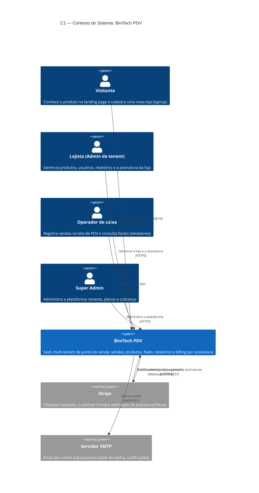
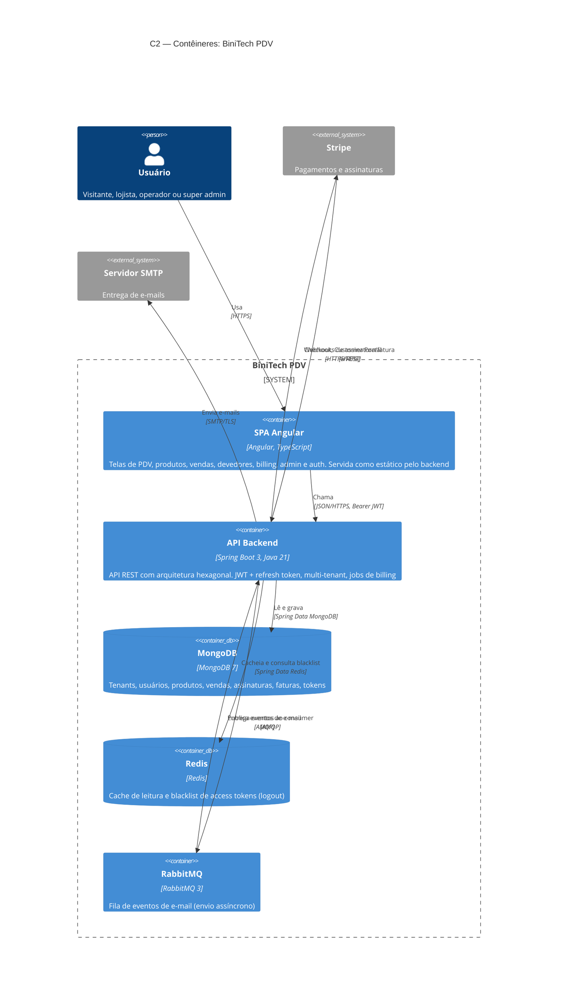
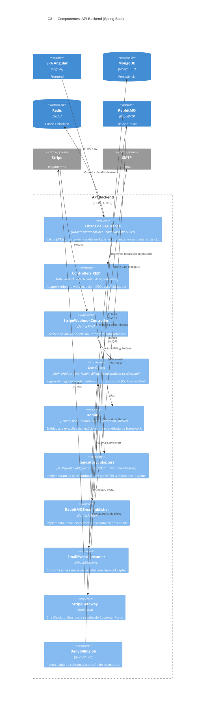

# Arquitetura — BiniTech PDV (C4 Model)

Diagramas no padrão [C4 Model](https://c4model.com/) em Mermaid. Renderizam direto no GitHub e no VS Code (com a extensão Mermaid).

## C1 — Diagrama de Contexto

O BiniTech PDV é um SaaS multi-tenant de ponto de venda. Cada loja (tenant) assina um plano e seus usuários operam vendas, produtos e relatórios.

## C2 — Diagrama de Contêineres

A SPA Angular é compilada no build do Docker e embutida como recurso estático no jar do Spring Boot — em produção é um único contêiner que serve frontend e API.

## C3 — Diagrama de Componentes (API Backend)

O backend segue arquitetura hexagonal (ports & adapters): controllers (adapters inbound) → use cases (application) → ports outbound → adapters outbound (persistência, mensageria, Stripe, e-mail).

## Notas

- **Multi-tenant**: o isolamento é lógico — todos os documentos carregam `tenantId` e o `TenantValidationFilter` garante o escopo por requisição.
- **Deploy**: o `Dockerfile` multi-stage compila a SPA (Node), embute o `dist/` em `src/main/resources/static/` e empacota tudo num único jar (Temurin 21). Healthcheck via `/actuator/health`.
- **E-mail resiliente**: o envio é desacoplado por fila (RabbitMQ); existe um `NoOpEmailServiceAdapter` para ambientes sem SMTP configurado.
